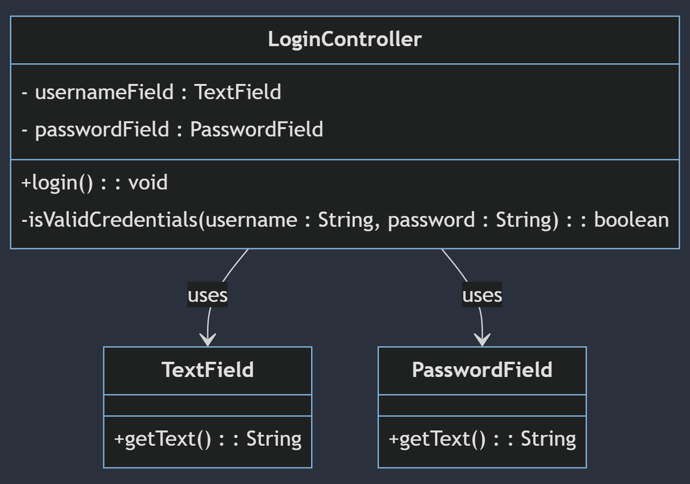

- **`LoginController`**: A classe principal com seus atributos e métodos.
  - `usernameField` e `passwordField` são atributos privados (`-`).
  - `login()` é um método público (`+`).
  - `isValidCredentials(username: String, password: String)` é um método privado (`-`).

- **`TextField` e `PasswordField`**: Classes que representam os tipos dos atributos `usernameField` e `passwordField`, com um método `getText()` que retorna uma `String`.

