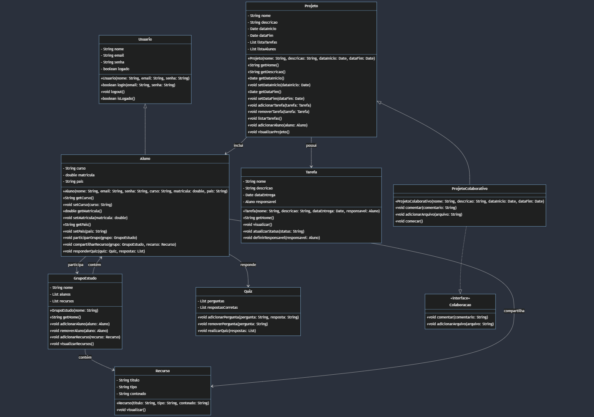

   ### Explicação do Diagrama

### Classes e Interfaces

1. **`Usuario`**
   - **Atributos**:
     - `nome`: Nome do usuário.
     - `email`: Email do usuário.
     - `senha`: Senha para login.
     - `logado`: Estado de login do usuário.
   - **Métodos**:
     - `login(email: String, senha: String)`: Método para fazer login.
     - `logout()`: Método para sair da sessão.
     - `isLogado()`: Verifica se o usuário está logado.

2. **`Aluno`** (Herda de `Usuario`)
   - **Atributos**:
     - `curso`: Curso em que o aluno está matriculado.
     - `matricula`: Número de matrícula do aluno.
     - `pais`: País de origem do aluno.
   - **Métodos**:
     - `participarGrupo(grupo: GrupoEstudo)`: Adiciona o aluno a um grupo de estudo.
     - `compartilharRecurso(grupo: GrupoEstudo, recurso: Recurso)`: Compartilha um recurso em um grupo de estudo.
     - `responderQuiz(quiz: Quiz, respostas: List<String>)`: Responde a um quiz.

3. **`GrupoEstudo`**
   - **Atributos**:
     - `nome`: Nome do grupo de estudo.
     - `alunos`: Lista de alunos no grupo.
     - `recursos`: Lista de recursos no grupo.
   - **Métodos**:
     - `adicionarAluno(aluno: Aluno)`: Adiciona um aluno ao grupo.
     - `removerAluno(aluno: Aluno)`: Remove um aluno do grupo.
     - `adicionarRecurso(recurso: Recurso)`: Adiciona um recurso ao grupo.
     - `visualizarRecursos()`: Mostra os recursos do grupo.

4. **`Recurso`**
   - **Atributos**:
     - `titulo`: Título do recurso.
     - `tipo`: Tipo do recurso (e.g., PDF, vídeo).
     - `conteudo`: Conteúdo do recurso.
   - **Métodos**:
     - `visualizar()`: Exibe os detalhes do recurso.

5. **`Quiz`**
   - **Atributos**:
     - `perguntas`: Lista de perguntas do quiz.
     - `respostasCorretas`: Lista de respostas corretas correspondentes às perguntas.
   - **Métodos**:
     - `adicionarPergunta(pergunta: String, resposta: String)`: Adiciona uma pergunta e resposta ao quiz.
     - `removerPergunta(pergunta: String)`: Remove uma pergunta do quiz.
     - `realizarQuiz(respostas: List<String>)`: Realiza o quiz com as respostas fornecidas.

6. **`Projeto`**
   - **Atributos**:
     - `nome`: Nome do projeto.
     - `descricao`: Descrição do projeto.
     - `dataInicio`: Data de início do projeto.
     - `dataFim`: Data de término do projeto.
     - `listaTarefas`: Lista de tarefas associadas ao projeto.
     - `listaAlunos`: Lista de alunos envolvidos no projeto.
   - **Métodos**:
     - `adicionarTarefa(tarefa: Tarefa)`: Adiciona uma tarefa ao projeto.
     - `removerTarefa(tarefa: Tarefa)`: Remove uma tarefa do projeto.
     - `listarTarefas()`: Lista todas as tarefas do projeto.
     - `adicionarAluno(aluno: Aluno)`: Adiciona um aluno ao projeto.
     - `visualizarProjeto()`: Exibe detalhes do projeto.

7. **`Tarefa`**
   - **Atributos**:
     - `nome`: Nome da tarefa.
     - `descricao`: Descrição da tarefa.
     - `dataEntrega`: Data de entrega da tarefa.
     - `responsavel`: Aluno responsável pela tarefa.
   - **Métodos**:
     - `visualizar()`: Exibe detalhes da tarefa.
     - `atualizarStatus(status: String)`: Atualiza o status da tarefa.
     - `definirResponsavel(responsavel: Aluno)`: Define um aluno como responsável pela tarefa.

8. **`ProjetoColaborativo`** (Herda de `Projeto` e implementa `Colaboracao`)
   - **Métodos**:
     - `comentar(comentario: String)`: Adiciona um comentário ao projeto colaborativo.
     - `adicionarArquivo(arquivo: String)`: Adiciona um arquivo ao projeto colaborativo.
     - `comecar()`: Inicia o projeto colaborativo.

9. **`Colaboracao`** (Interface)
   - **Métodos**:
     - `comentar(comentario: String)`: Método para adicionar um comentário.
     - `adicionarArquivo(arquivo: String)`: Método para adicionar um arquivo.

### Relações entre Classes

- **`Usuario`** é a superclasse de **`Aluno`**.
- **`Projeto`** é a superclasse de **`ProjetoColaborativo`**.
- **`ProjetoColaborativo`** implementa a interface **`Colaboracao`**.
- **`GrupoEstudo`** contém **`Aluno`** e **`Recurso`**.
- **`Aluno`** participa de **`GrupoEstudo`** e compartilha **`Recurso`**.
- **`Aluno`** também responde a **`Quiz`**.
- **`Projeto`** possui **`Tarefa`** e inclui **`Aluno`**.